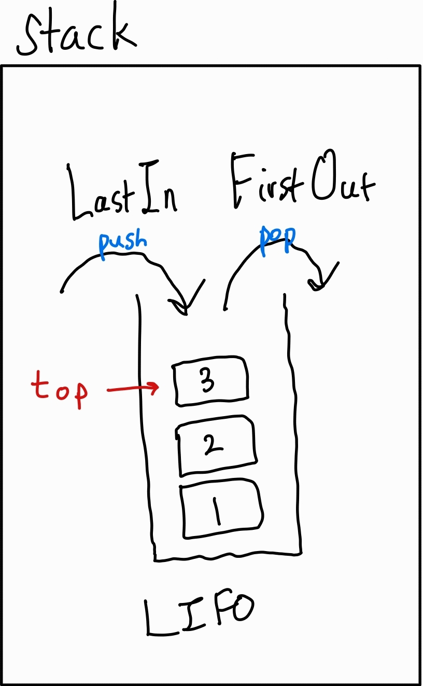
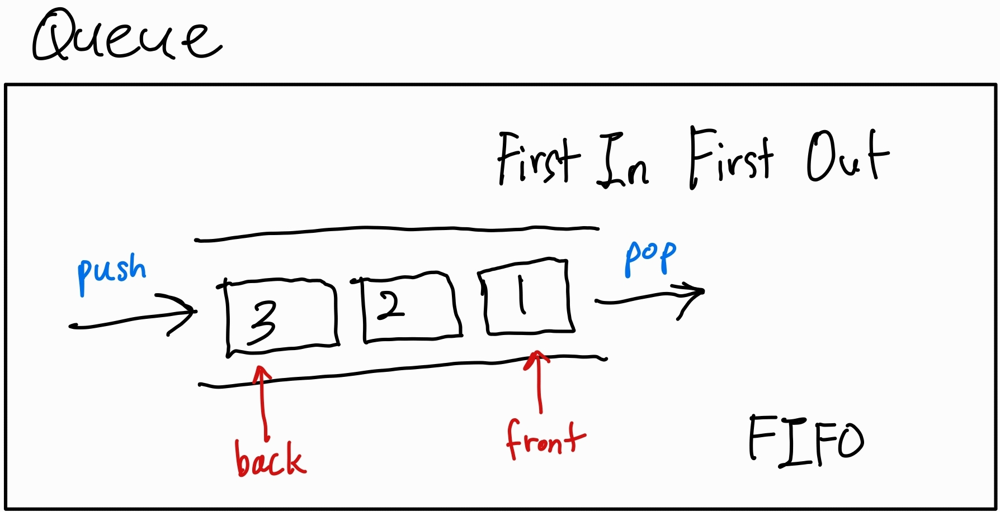
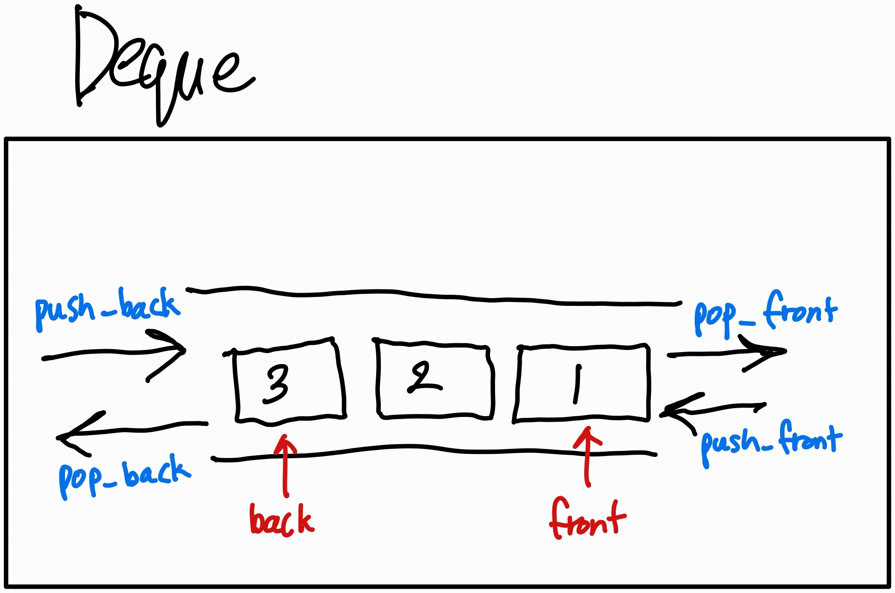

# Stack

<!--  -->



 - **LIFO** (Last In First Out)
 - 마지막에 들어온게 가장 먼저 나온다
    - FILO 인지 LIFO인지 헷갈리면 *First Out* 생각하기
 - 
## Methods
 - `top()` : 가장 위에 있는 값을 반환한다
   - does not check whether the stack if empty or not
 - `pop()` : 가장 위에 있는 값을 제거한다
   - does not check whether the stack if empty or not
 - `empty()` : 1 if empty, 0 if not empty
 - `push( X )` : insert element X at top
 - `size()` : returns number of elements
---
 - *`emplace( Args&&... args )`* (C++11)
 - `swap( stack& other )` (C++11) : exchange contents of with other stack

### emplace
 - push가 하는 일과 결과적으로는 완전 같다
 - emplace가 다른 점은 "The element is constructed in-place"
    - 받은 args를 사용해 constructor를 call해서 원하는 위치에 새로운 instance를 바로 생성한다
    - 따라서 추가적인 copy나 move를 하지 않기 때문에 상황에 따라(?) push보다 효율적일 수 도있다
    - push는 parameter로 받은 값을 copy해서 집어넣는다
  ```c++
    #include <iostream>
    #include <stack>
    
    struct S
    {
        int id;
    
        S(int i, double d, std::string s) : id{i}
        {
            std::cout << "S::S(" << i << ", " << d << ", \"" << s << "\");\n";
        }
    };
    
    int main()
    {
        std::stack<S> adaptor;
    
        const S& s = adaptor.emplace(42, 3.14, "C++"); // for return value C++17 required
    
        std::cout << "id = " << s.id << '\n';
    }
  ```
   - https://en.cppreference.com/w/cpp/container/stack/emplace

# Queue



 - **FIFO** (First In First Out)

## Methods
 - `empty()` : 1 if empty else 0
 - `size()` : returns size
 - `front()` : returns reference to next(aka "oldest") element
   - does not check if Q is empty
 - `back()` : returns reference to last(aka "newest") element
   - does not check if Q is empty
 - `push( X )` : insert new element to back
 - `pop()` : removes next element
   - does not check if Q is empty
---
 - `emplace( Args&&... args)`
 - `swap( queue& other )`

# Deque



 - stack 과 queue의 특징을 모두 가지고 있다
 - 앞뒤가 뚤려있다 (양방향으로 들어오고 나갈 수 있다)
 - elements are not stored contiguously
    - more like linked list
 - cheaper to expand but has large minimal memory cost(?)

## Methods [^1]
[^1]: https://en.cppreference.com/w/cpp/container/deque
### Element Access
 - `at( pos )`
 - `front()`
 - `back()`
 - `[ pos ]`
### Capacity
 - `empty()`
 - `size()`
 - `max_size()`
 - `shrink_to_fit()`
### Modifiers
 - `clear()`
 - `insert( iterator_pos, value )`
 - `erase( iterator_pos )`
 - `push_back( value )`
 - `push_front( value )`
 - `pop_back()`
 - `pop_front()`
 - `resize()`
   - `resize( count )`
   - `resize( count, value )`
---
 - 여기도 emplace랑 다른거 더 많음


# C++ 팁
 - 전역 변수는 0으로 초기화 된다
 ```cpp
   ...

   int ARR[10][10]; // values are initialized to 0
   
   int main() {
      ...
   }
 ```
## Initialization
 - Initialize with Declaration
   - `int arr[10] = {0, };`
 - memset
   - can initialize to 0
   - `memset(arr, 0, sizeof(arr));`
 - fill
   - needs iterator
   - ex) `fill(v.begin(), v.end(), -1);`