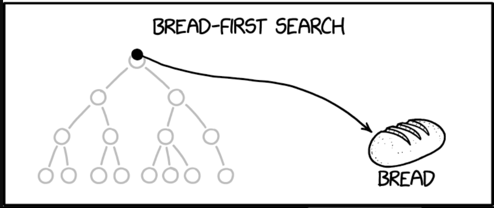
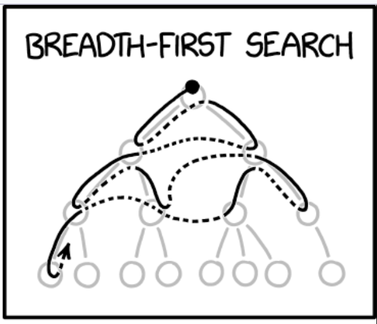
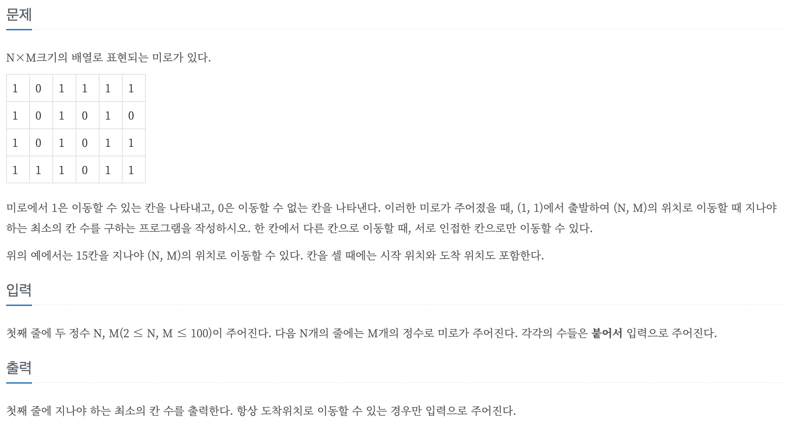

# BFS

> Breadth First Search

> 너비 우선 탐색

 [^1]

[^1]:https://xkcd.com/2407/

##### *xkcd*
<br>

----
<br>


 [^2]

[^2]:https://xkcd.com/2407/


 - 넓게 보는 것이 우선순위 이다
 - Queue를 사용해야 한다

## BFS core code:
```cpp
void BFS(int start) {
    queue<int> Q;
    Q.push(start);
    visited[start] = true;

    while(!Q.empty()) {
        int curr = Q.front();
        Q.pop();

        for(int i=0; i<graph[curr].size(); i++) {
            int next = graph[curr][i];
            if(!visited[next]) {
                visited[next] = true;
                Q.push(next);
            }
        }
    }
}
```
## 코드 설명
### 1. 시작하는 값을 Q에 넣고 방문 체크를 한다
```cpp
    Q.push(start);
    visited[start] = true;
```

### 2. Q가 빌 때까지 루프를 돌릴거다
```cpp
    while(!Q.empty()) {
        ...
    }
```

### 3. Q에 있는 숫자를 하나 뺀다
```cpp
    while(..) {
        int curr = Q.front();
        Q.pop();

        ..
    }
```
\*\*\*\*\*\*\*

### **3.5** 만약 BFS를 하면서 어떤 계산을 해야 한다면 여기서 한다

\*\*\*\*\*\*\*

### 4. 방문한 적이 없는 인접 노드가 있다면 Q에 추가한다
```cpp
    while(..) {
        ..

        for(int i=0; i<graph[curr].size(); i++) {
            int next = graph[curr][i];
            if(!visited[next]) {
                visited[next] = true;
                Q.push(next);
            }
        }
    }
```


## **boj - 1278** 


